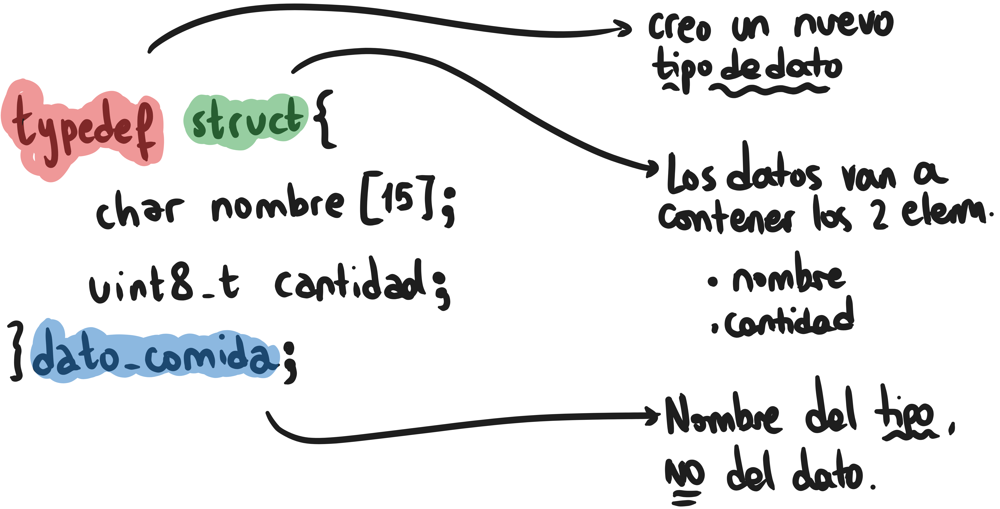

# Manejo de la información


## Strings en C, no tan amigables...
...pero tampoco _tan poco_.

Dado que los strings en C no son un elemento único sino una _sucesión de caracteres_, no se pueden manejar como los tipos de dato que ya conocemos. ~~Existe un tipo de dato _String_ en C++ más parecido al de, por ejemplo, Pythonen, but we don't do that in here.~~ Es decir, **no se puede** hacer, por ejemplo:

    char nombre[4] = "hola";

ni tampoco:
    
    if(nombre == "hola") { ... }

Existe una biblioteca que se encarga de hacer las asignaciones, comparaciones, copias, etc. por nosotros. Es decir, vamos a usar funciones para realizar todas las acciones que conocemos en lugar de realizarlas directamente.

#### Antes que nada...
En todos los archivos en que manejemos Strings vamos a tener que importar la biblioteca:
   
    #include "string.h"

#### ...fin del paréntesis

### Dato no menor
Los strings en C/C++ _siempre siempre siempre_ reservan el **último** caracter para almacenar un caracter especial, el **caracter nulo** (```'\n'``` para los amigos). Es decir, un ```char hola[15];``` en realidad puede almacenar palabras de hasta 14 letras. No se puede hacer nada al respecto, we have to live with that.

### Operaciones de string

Supongamos que para todos los ejemplos a continuación contamos con las siguientes variables:

    char var1[15];
    char var2[15];

* #### Asignación de valores

      strcpy(var1, "hola! :D")
      strcpy(var2, "medialuna")

    Resultado: en ```var1``` se guarda lo que pusimos entre comillas. _y lo mismo para ```var2```_.

    **Mucho cuidado con esto!**: debemos asegurarnos que _lo que copiamos_ cabe en _donde lo queremos copiar_. En este caso, no hay que intentar copiar strings con más de 14 caracteres.

* #### Comparación de strings

        if(strcmp(var1, var2) == 0) {
            // las strings son iguales :D
        } else {
            // las strings son igualen'ts :(
        }

    _Acá claramente **no** va a dar 0_

* #### Obtener longitud de un string

        uint8_t largo = strlen(var1);
        // largo = 8

    Ojo - esto nos da la cantidad de caracteres **sin contar** el caracter nulo del final.